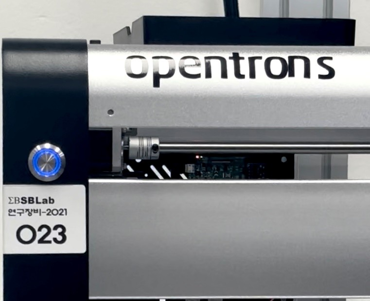
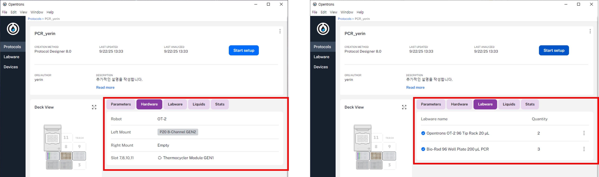
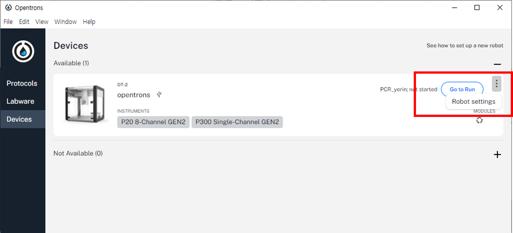
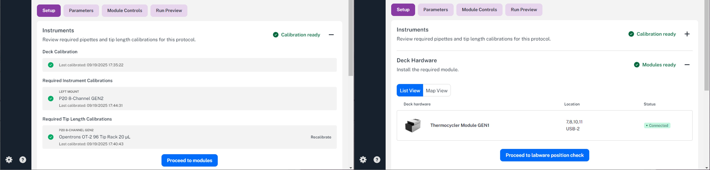
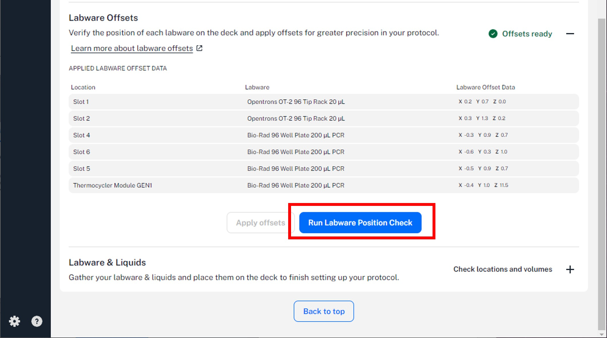
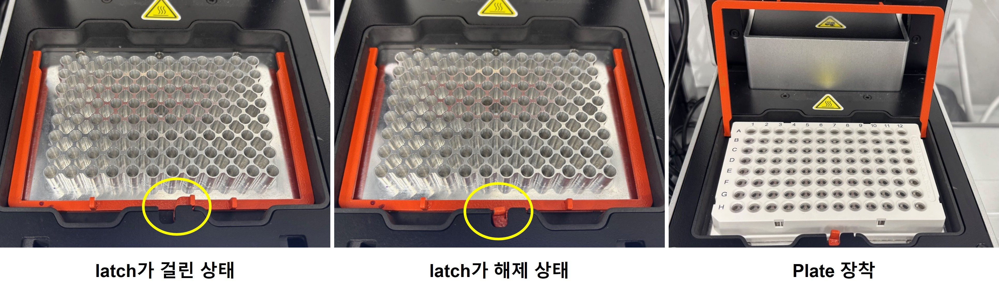

# OT-2 Operation Manual
- Author : Yerin Yoon
- Date : 2024-09-29

## Contents

**Overview**
1. 매뉴얼 목적 및 범위

**Labware**  

2. 지원되는 랩웨어
3. 커스텀 랩웨어 정의

**OT-2 Operation**  

4. 시작 전 확인 사항 (Pre-Check)
5. OT-2 전원 켜기
6. 프로토콜 불러오기
7. 프로토콜 실행 전 세팅
8. 프로토콜 실행 및 정리

**Appendix**  

9. Troubleshooting

---
### 1. 매뉴얼 목적 및 범위
이 매뉴얼은 **Opentrons OT-2**를 사용하기 위한 단계별 지침을 제공합니다.

사용자는 이미 준비된 프로토콜을 기반으로 다음을 수행할 수 있습니다:

- OT-2에 프로토콜 불러오기
- Deck에 Labware와 소모품 배치하기
- 안전하고 정확하게 Run 실행하기
- 실험 종료 후 폐기물 관리 및 장비 정리하기

본 문서는 **프로토콜 설계가 아닌 OT-2의 사용 방법**에 초점을 둡니다

---
### 2. 지원되는 Labware

- Opentrons에서 지원하는 Labware는 **[Labware Library](https://labware.opentrons.com/)** 에서 확인할 수 있습니다.
- 사용하는 Labware가 라이브러리에 정의되어 있지 않은 경우, 별도의 **Custom Labware Definition**을 생성해야 합니다.
- Custom Labware는 **[Custom Labware Creator↗️](https://labware.opentrons.com/#/create)** 도구를 통해 제작할 수 있습니다.

---
### 3. 커스텀 랩웨어 정의

#### Labware Creator 사용 조건

다음 조건을 모두 충족하는 경우에만 Labware Creator를 사용하십시오:

1. 모든 웰(Well) 및 튜브(Tube)의 크기와 용량이 동일해야 합니다.
2. 모든 행(Row)과 열(Column)의 간격이 일정해야 합니다.
3. 어댑터 없이 로봇 Deck에 정확히 장착될 수 있어야 합니다.

> [!NOTE]
> 
> 조건 충족 시 Labware Creator에 접속 → Labware 종류 선택 → 치수 입력 → JSON 파일 생성
> 
> 조건 불충족 시 Labware Creator로 정의 불가 → Opentrons Support에 요청 필요
> 

#### 주의 사항

- 가능하다면 제조사에서 제공하는 기계 도면(mechanical drawing)을 활용하십시오.
- 수동 측정은 누락된 정보를 보완하는 용도로만 사용하십시오.
- 캘리퍼스(calipers) 사용을 권장하며, 자(ruler) 사용은 최소화해야 합니다.
- 추가 측정 팁은 [**Opentrons Support Guide**](https://support.opentrons.com/s/article/Creating-Custom-Labware-Definitions)를 참고하십시오.

#### Labware 측정 가이드라인

- **기본 원칙:** 캘리퍼스를 이용하여 여러 번 측정 후 평균값을 산출하십시오.
- **Depth:** 캘리퍼스의 depth 기능을 활용하십시오.
    - 해당 기능이 없을 경우, 종이 조각이나 단단한 클립을 웰에 삽입하여 상단을 표시한 후 꺼내어 측정할 수 있습니다.
    - ⚠️ 실이나 끈은 사용하지 마십시오.
- **Well Spacing:** 인접 well 중심 간의 거리를 의미합니다.
    - 전체 행(row) 또는 열(column)의 길이를 측정한 뒤 well 개수로 나누는 방식이 더 정확합니다.
- **Offset:** well 중심과 labware 외곽 벽 사이의 거리를 의미합니다.
    - 측정 시 labware를 평평한 수직 벽에 맞춘 후, well 중심에서 해당 벽까지의 거리를 측정하십시오.

---
### 4. 시작 전 확인 사항 (Pre-Check)

피펫 장착 여부

- 실행하려는 프로토콜에서 요구하는 피펫이 올바른 위치에 장착되어 있는지 확인하십시오.

모듈 연결 상태

- Thermocycler 등 사용 모듈이 Deck에 올바르게 장착되고, 연결 케이블이 제대로 꽂혀 있는지 확인하십시오.

소모품 준비

- 프로토콜 수행에 필요한 Tip Rack이 충분히 준비되어 있는지 확인하십시오.

폐기물 관리

- OT-2 Trash Bin이 비워져 있는지 확인하십시오. 실험 중 팁 폐기가 원활히 이루어질 수 있도록 준비합니다.

---
### 5. OT-2 전원 켜기

① OT-2 소프트웨어가 설치된 PC의 전원을 켭니다.

② OT-2 왼쪽 측면 하단에 있는 전원 스위치를 눌러 켭니다.

③ 전면 LED가 처음에는 파란색으로 깜박이다가 이후 고정 파란색으로 변경됩니다. 동시에 피펫 마운트가 움직이며 기계음이 들리면 준비 완료입니다.

  

---
### 6. 프로토콜 불러오기

① 바탕화면에서 Opentrons App 아이콘 
 을 실행합니다.

② 좌측 메뉴 <b>Protocols</b> → 상단 <b>Import</b> 버튼을 클릭하여 사용할 프로토콜 파일(<code>.json</code>, <code>.py</code>)을 업로드합니다.

③ 업로드된 프로토콜을 선택한 뒤, <b>Hardware / Labware</b> 탭에서 다음을 확인하십시오.

<ul>
  <li>피펫 종류 및 장착 위치 (Left / Right mount)</li>
  <li>모듈 종류 및 위치</li>
  <li>사용되는 Labware 종류와 개수</li>
</ul>

  

④ 확인 후 Strat setup 버튼을 클릭합니다.

⑤ 연결된 로봇을 선택한 뒤, 하단의 Proceed to Setup 버튼을 클릭하여 세팅 단계로 이동합니다.

---
### 7. 프로토콜 실행 전 세팅

① 좌측 메뉴 <b>Devices</b> 섹션에서 선택한 로봇에 프로토콜이 로드되고, <b>Go to Run</b> 버튼이 활성화되면 클릭합니다.

- 필요 시, <b>메뉴 ⋮ → Robot Settings → Calibration Status</b>에서 보정 상태를 확인할 수 있습니다.

  

② 화면 하단 <b>Set up</b> 섹션에서 다음 항목이 모두 ✅ Ready 상태인지 확인하십시오.

- **Instruments** : Calibration 필요 시 Opentrons App 안내에 따라 수행
- **Deck Hardware** : 필요한 모듈 연결 상태 확인
- **Labware Offsets** : Labware Position Check 권장
- **Labware & Liquids** : 실제 Deck 배치와 일치 여부 확인

→ 각 항목 **오른쪽 + 버튼**을 눌러 세부 내용을 확인할 수 있습니다. 

  

③ Labware Offsets 항목의 + 버튼을 클릭한 뒤, 하단의 Run Labware Position Check 버튼을 클릭합니다. 화면 안내에 따라 프로토콜에 포함된 각 Labware의 위치를 실제 Deck과 맞도록 조정합니다.

  

> [!NOTE]  
> 
> **Labware Offsets (Labware Position Check) 가이드**
> 
> **1. 항상 권장**
> - **모든 프로토콜 실행 전 Labware Postition Cheak 수행 권장**
> - Well 위치 오차를 보정 해 Transfer 실패 및 충돌 예방 
> 
> **2. 저장된 Offset 데이터 활용**
> - 같은 Labware/Deck 배치에서 실행 시, 저장된 Offset 데이터 자동 적용
> - 단, Labware 교체 · Deck 이동 · 충격 발생 시 → **반드시 Position Check 다시 수행**
> 
> **3. Tip**
> - 같은 조건에서 연속 실행 시에는 Offset 데이터 그대로 사용 가능
> - 단, **하루 첫 실행 시에는 Position Check 수행 권장**

④ Labware & Liquids 항목의 + 버튼을 클릭하여, 프로토콜 상에 정의된 랩웨어·모듈의 종류와 Deck 위치를 확인합니다. 실제 Deck에 동일하게 배치한 뒤, 하단의 Confirm placements 버튼을 눌러 완료합니다.

> [!IMPORTANT]
> 
> 프로토콜에 정의된 **Hardware / Labware가 실제 Deck 세팅과 불일치할 경우 실험 실패** 및 **장비 손상**이 발생할 수 있습니다.
> 
> 반드시 일치 여부를 확인하십시오.

  

> [!CAUTION]
> **Thermocycler GEN1 사용 시 주의사항**
> - GEN1에는 **주황색 잠금장치(latch)** 가 있습니다.  
> - **Well plate 장착/분리 시 latch에 걸리지 않도록 반드시 주의하십시오.**
> 

  

⑤ 최종적으로 <b>Set up</b> 섹션 내 모든 항목이 ✅ Ready 상태임을 확인하십시오

> [!IMPORTANT]  
> 모든 항목이 ✅ Ready 상태여야만 다음 단계로 진행할 수 있습니다.

---
### 8. 프로토콜 실행 및 정리

① 화면 상단 ▶Strat run 버튼을 눌러 프로토콜을 실행시킵니다.

- 실행 중에는 Run Preview 화면에 현재 Step과 진행 상황이 표시됩니다.

② 실험이 완료되면 화면 상단에 ✅ Run completed 메시지가 표시됩니다.

③ 종료 후에는 Trash bin의 사용한 팁을 비우고, Deck 위 Labware를 정리합니다.

---
### 9. Troubleshooting
추가 예정