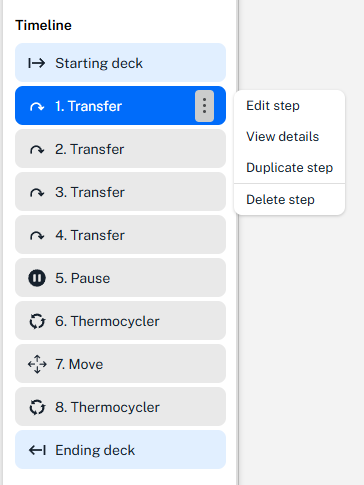

# Opentrons Protocol Designer_Manual

# Protocol Designer

본 도구는 **코드 작성 없이도 OT-2용 피펫팅 프로토콜을 설계**할 수 있도록 지원합니다.

- OT-2 표준 랩웨어 기반의 프로토콜 설계 지원
- 소스 플레이트에 액체 할당 및 이동 경로 추적 기능 제공
- **Transfer(이동)**, **Mix(혼합)**, **Pause(일시정지)** 단계의 추가 및 편집 가능
- 설계된 프로토콜을 OT-2에서 실행 가능한 형식으로 내보내기 지원

## 사용 가능한 Labware

- Protocol Designer에서 지원되는 랩웨어는 [**Labware Library↗️**]((https://labware.opentrons.com/#/)) 에서 확인할 수 있습니다.
- 만약 사용하는 랩웨어가 라이브러리에 정의되어 있지 않은 경우, 아래 링크를 통해 **맞춤형(Custom) 랩웨어 정의**를 생성해야 합니다. 👉 [**Labware Creator**](https://labware.opentrons.com/#/create)

> 📄 **NOTE**   
>
>**현재 사용 가능한 피펫, 모듈 리스트 (25.09)**
>
> - 1-Channel GEN2 P300
> - 1-Channel GEN2 P20
> - 8-Channel GEN2 P300
> - 8-Channel GEN2 P20
> - Thermocycler Module GEN1
>

## Step 1 : Create a protocol

1. [**Opentrons Protocol Designer↗️**](https://designer.opentrons.com/?_gl=1*si8noa*_ga*NzQ0OTY1MTczLjE3NTgwNjg5MDY.*_ga_66HK7MC5D7*czE3NTgwNjg5MDYkbzEkZzEkdDE3NTgwNzExNjYkajI3JGwwJGgw*_gcl_au*MTQxNDcwMzA2Ni4xNzU4MDY4OTA2*_ga_GNSMNLW4RY*czE3NTgwNjg5MDYkbzEkZzEkdDE3NTgwNzExNjQkajI5JGwwJGgxNDA1MjgyODY1) 접속 후 **`Create a protocol`** 을 클릭합니다.
2. **`Opentrons OT-2`**  를 선택합니다.
3. **`+ Add a pipette`** 을 클릭합니다.
4. 사용할 **피펫**과 해당 **팁 랙(tip rack) 유형**을 지정합니다.
5. **`Save`** 를 클릭하고, 더 추가할 피펫이 없다면 **`Confirm`** 을 클릭합니다.

  
  

## Step 2 : Add your modules

1. 프로토콜에 사용할 모듈을 선택합니다. 
2. 선택이 완료되면 **`Confirm`** 을 클릭합니다. 

  

## Step 3 : Tell us about your protocol

1. **Protocol 이름 / 프로토콜에 대한 설명 / 작성자 또는 소속**을 입력합니다.
2. 완료 후 **`Confirm`** 을 클릭합니다.

  

## Step 4 : Define Liquids

> 💡 **참고:**  
> 이전 단계에서 설정한 사항은 각 섹션의 **우측 상단 Edit 버튼**을 클릭하여 수정할 수 있습니다.

1. 우측 상단에 **`Edit protocol`** 을 클릭한다. 

  

2. 왼쪽 상단의 **`💧Liquids`** 버튼을 클릭하고,  **`+ Define a liquid`** 클릭합니다.

  

3. 사용할 **liquid의 이름과 설명을 입력**하고, 필요 시 색상을 지정합니다. 입력을 마쳤으면 **`Save`**를 클릭합니다.  해당 프로토콜에서 사용하는 **모든 liquid를 동일한 방법으로 추가**합니다.

  

## Step 5 : Add Labware

> **📄NOTE** 
> 
> 화면 왼쪽 **Timeline** 섹션에서 **`Starting deck`** 을  세팅해야 합니다.
> 
> → **`Starting deck`** 은 **프로토콜 시작 시점에 로봇 deck 위에 어떤 Labware가 어디 위치에 놓여 있는지를 정의하는 초기 세팅 값**입니다. 
> 즉 프로토콜이 실행되기 전 로봇이 참조할 **기본 상태(initial state)** 을 설정하는 단계입니다. 
>

1. 원하는 위치의 **Deck 슬롯**에 마우스를 올리고 **더블 클릭**합니다.

  

2. 화면 우측 상단의 **`+ Add labware`** 를 클릭합니다.
3. 사용할 **Labware를 검색 및 선택**한 후, **`Add labware`**  → **`Done`** 을 클릭하여 추가합니다. 

  

4. 프로토콜에서 사용할 **모든 Labware를 동일한 방법으로 추가**합니다.
	- 추가된 Labware는 드래그 앤 드롭(Drag & Drop)으로 위치를 수정할 수 있습니다.

## Step 6 : Add Liquids to Wells

1. **Starting deck** 에서 편집하려는 **Labware를 클릭**한 후 나타나는 **`Edit labware`** 버튼을 클릭합니다.

  

    

2. 회색 박스 왼쪽 하단 **Edit liquid** 을 클릭해서 이전 단계에서 추가한 Liquid를 Well에 지정합니다.
    - 회색 박스 오른쪽 상단 **`⋮`** (메뉴)를 클릭하여 Labware 이름을 수정하거나 삭제할 수 있습니다.

  

        

3. 원하는 Well을 클릭하거나 드래그하여 선택한 뒤, 오른쪽 **`Add liquid`** 섹션에서 Liquid를 선택하고 Volume을 입력한 후 **`Save`** 를 클릭합니다.
    - 필요하다면 화면 상단의 **`💧 **Liquids` 버튼** 을 눌러 새로운 Liquid를 추가하거나 수정할 수 있습니다.

  

4. Liquid 추가가 완료되면 화면 **오른쪽 하단의 `Done` 버튼**을 클릭하여 작업을 마무리합니다.

  

## Step 7 : Add Step

1. **`Starting deck`** 설정이 완료되면, 화면 왼쪽 하단의 **`+ Add Step`** 버튼을 클릭하여 원하는 Step 을 추가합니다.

  

2. **Transfer step을 선택하는 경우**, 화면 오른쪽 항목들을 입력한 뒤, **`Continue`** 버튼을 클릭합니다. 
    - 현재 프로토콜 조건에서 선택 가능한 옵션만 표시되며, 지원되지 않는 옵션은 비활성화 됩니다.

> **💡참고**
> - **Pipette path** : 각 옵션에 마우스를 올리면 동작 방식을 보여주는 애니메이션 설명이 표시됩니다.
> 
> - **Tip management**
>
>	- **Always** : 매번 새로운 팁을 사용합니다. 오염 방지에는 안전하나, 팁 소모량이 많습니다.
>	- **Never** : 새로운 팁을 집지 않고, 장착된 팁(또는 팁 없이)을 그대로 사용합니다. 특수 상황에서만 활용됩니다.
>	- **Once**  : 한 번 집은 팁을 여러 동작에서 재사용합니다. 팁 소모를 줄일 수 있으나, 교차 오염 위험이 있습니다
>	- **Per destination** : 목적지 웰마다 새로운 팁을 사용합니다.
>	- **Per source** : 소스 웰마다 새로운 팁을 사용합니다.
>

3. **Aspirate/Dispense 동작을 사용자 정의(Customize)** 할 수 있습니다. 제공되는 옵션을 탐색한 후, 하단의 **`Save`** 버튼을 눌러 저장합니다.

4. 원하는 Step을 추가한 후, 해당 Step 오른쪽 **`⋮`** (메뉴)를 클릭하고, **`View details`** 를 클릭하면 세부 설정을 확인할 수 있습니다.

    - 화면 오른쪽 **Transfer details** 섹션에서 각 단계의 동작을 상세히 확인할 수 있습니다.
    - 각 Box 위에 마우스를 올리면, 왼쪽 Deck 위에 올려진 Labware에서 해당 Well이 색상으로 표시되어 **액체가 어떻게 Transfer 되는지 시각적으로 확인**할 수 있습니다.
    - **`Done`** 버튼 위에 마우스를 올리면, 해당 Step이 완료된 이후의 상태를 확인할 수 있습니다.

  
  

## Step 8 : Check your work

1. 모든 설정이 완료되면, **`Final Deck State`** Step을 클릭합니다.
2. Ending deck에서 원하는 Labware를 클릭한 후, 각 Well 위에 마우스를 올리면 프로토콜 실행이 끝난 시점에서의 **최종 상태(Final state)** 를 확인할 수 있습니다.
    - 각 Well에 남아 있는 **liquid의 종류**와 **volume**을 시각적으로 확인할 수 있습니다.

  
  

## Step 9 : Export your protocol

1. 화면 상단의  **`Export`** 를 클릭합니다. 
2. 프로토콜이 **Python File** 형식으로 컴퓨터에 다운로드됩니다.
3. 다운로드된 **Python File** 파일은 Opentrons App에 업로드하여 로봇에서 실행할 수 있습니다.