- [NOTABLE manual](#notable-manual)
- [1. 노터블 시작하기](#1-노터블-시작하기)
  - [1. 전원 및 연결](#1-전원-및-연결)
    - [LED 상태표시등](#led-상태표시등)
  - [2. 파이펫 탈부착 방법](#2-파이펫-탈부착-방법)
- [2. 프로토콜 만들기](#2-프로토콜-만들기)
  - [1. Windy 실행 및 새 프로토콜 생성](#1-windy-실행-및-새-프로토콜-생성)
  - [2. Preparation](#2-preparation)
    - [파이펫 설정](#파이펫-설정)
    - [랩웨어 구성](#랩웨어-구성)
  - [3. STEP 구성](#3-step-구성)
    - [STEP 진입](#step-진입)
    - [Pipette 선택](#pipette-선택)
    - [Source / Target Labware 지정](#source--target-labware-지정)
    - [Well 설정](#well-설정)
    - [Dispense 설정 및 저장](#dispense-설정-및-저장)
    - [OPTION 세부 설정](#option-세부-설정)
      - [1. 기본 옵션 설정](#1-기본-옵션-설정)
      - [2. Dispense Method / Pipette Route](#2-dispense-method--pipette-route)
      - [3. Aspirate Method](#3-aspirate-method)
      - [4. Pipette Route](#4-pipette-route)
- [3. 프로토콜 실행 및 결과 확인](#3-프로토콜-실행-및-결과-확인)
  - [1. RUN - 프로토콜 실행](#1-run---프로토콜-실행)
  - [2. 기존 프로토콜 불러오기](#2-기존-프로토콜-불러오기)
  - [3. REPORT - 결과 확인](#3-report---결과-확인)
      - [리포트 결과 항목 정의](#리포트-결과-항목-정의)
      - [추가 기능 버튼 정의](#추가-기능-버튼-정의)

# NOTABLE manual

# 1. 노터블 시작하기

## 1. 전원 및 연결

1. PC를 켠 후, 노터블의 전원 버튼을 눌러주세요. 상태표시등에 흰색 조명이 들어오면, 로봇과 PC의 연결이 완료된 상태입니다.
    

    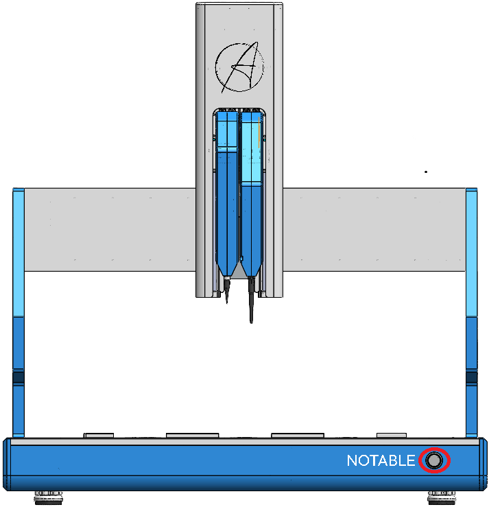

2. 노터블의 소프트웨어 **Windy** 를 실행합니다.

### LED 상태표시등

PC와 로봇이 연결되어 있고 로봇의 전원이 켜진 상태에서 Windy 소프트웨어를 실행하면 상태표시등이 아래와 같이 표시됩니다.

| LED 색상 | 상태 (영문) | 상태 설명 | 추가 설명 |
| --- | --- | --- | --- |
| **흰색 (White)** | IDLE | 대기 / 완료 | 로봇이 작업을 수행하지 않고 대기 중이거나 모든 작업이 완료된 상태 |
| **초록색 (Green)** | RUN | 작업 진행 중 | 프로토콜 실행 중 LED가 오른쪽으로 확장되며 작업의 진행도를 표시 |
| **파랑색 (Blue)** | INITIALIZE | 준비 중 | [Run] 을 시작하기 전 준비 단계에서 LED가 깜빡임 |
| **노랑색 (Yellow)** | PAUSE | 일시 중지 | [Stop] 버튼을 눌러 일시 중지 시 LED가 깜빡임 |
| **빨강색 (Red)** | ERROR | 오류 발생 | 로봇에 문제나 오류가 발생했을 때 LED가 깜빡임 |

## 2. 파이펫 탈부착 방법

⚠️ <strong>주의:</strong> 파이펫 장착 및 탈착은 <strong>반드시 로봇 전원이 꺼져 있을 때만</strong> 진행해 주세요.

 

1. **노터블 전원을 OFF** 합니다.
2. 파이펫에 접근하기 위해 **Y축을 전방(앞쪽)** 으로, **Z축을 하단 방향**으로 이동시킵니다. 
    
    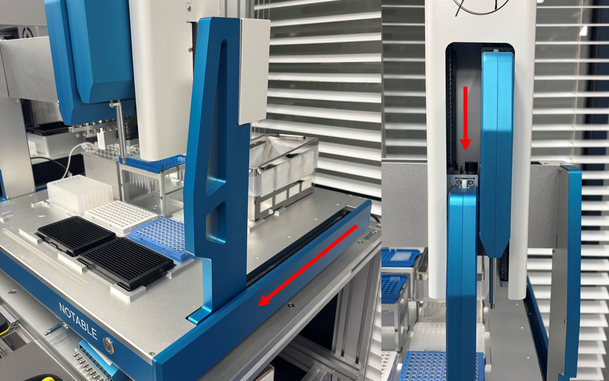

3. 파이펫을 분리할 때는 상단의 **흰색 잠금 레버를 누른 상태**로, 파이펫 **앞쪽으로 천천히 당겨 분리**합니다. 
탈착 하면서, 파이펫 하단이 걸릴 때에는 무리하게 당기지 말고 **살짝 위로 들어 올리며 빼냅니다.** 
    

    
    

4. 새로운 파이펫을 장착할 때는 **파이펫 하단의 홈 위치를 먼저 맞춘 뒤,** 아래쪽 홈이 정확히 끼워졌는지 확인합니다. 이후 **파이펫 상단을 안쪽 방향으로 밀어 넣어 결합합니다.**
    
    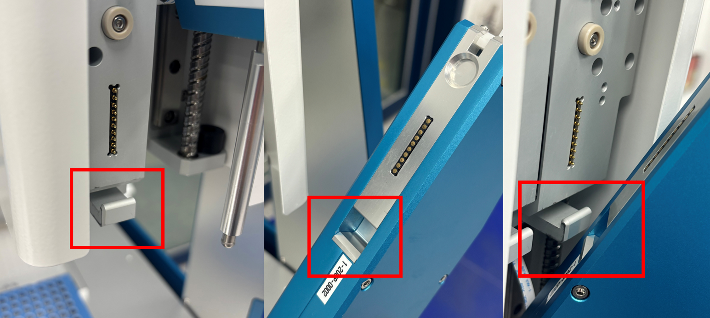
    

💡 <strong>TIP:</strong> 파이펫 상단을 안쪽 방향으로 밀어 넣으면서,
하단은 <strong>반대 방향으로 살짝 힘을 주면</strong> 더욱 쉽게 결합할 수 있습니다.
    

  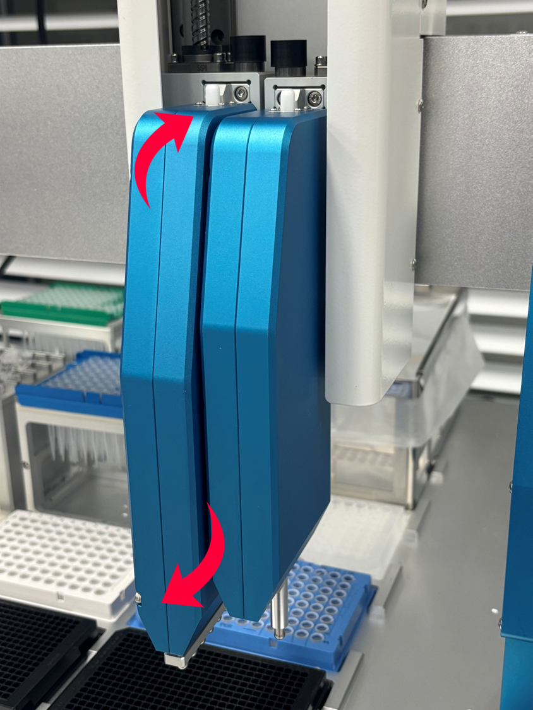

    

---

# 2. 프로토콜 만들기

## 1. Windy 실행 및 새 프로토콜 생성

1. 바탕화면의 **Windy - 바로가기** 아이콘을 더블 클릭합니다.
2. 프로그램이 실행되면 첫 화면에서 **`NEW PROTOCOL`** 버튼을 를 클릭하면 **`PREPARATION`** 페이지로 이동합니다.
    

    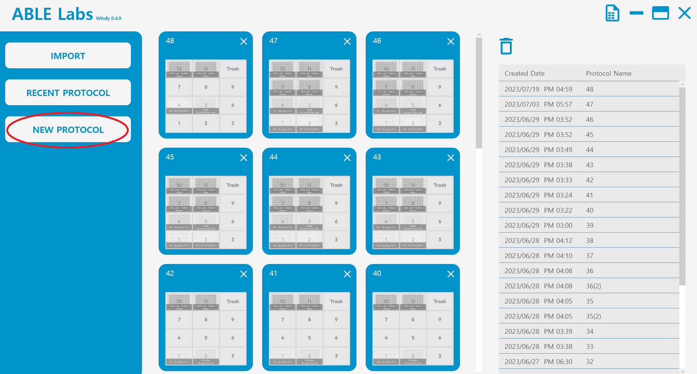
    

    

## 2. Preparation

Windy 소프트웨어에서 새로운 프로토콜을 생성하고, 파이펫 및 랩웨어 구성을 설정하는 단계입니다.
이 단계에서는 로봇의 실제 덱(deck) 상태와 동일하게 화면 구성을 완료해야 합니다.

### 파이펫 설정

1.  화면 우측의 Pipette 설정 영역에서 로봇에 실제로 장착된 파이펫과 일치하도록, **왼쪽(LEFT)**, **오른쪽(RIGHT)** 파이펫을 각각 지정합니다.
    - 선택한 파이펫 종류에 따라 해당 Tip Rack의 종류와 위치가 자동으로 설정됩니다.
        
        **LEFT → 10번 위치**, **RIGHT → 11번 위치**에 자동 배정됩니다.
        
    
    

    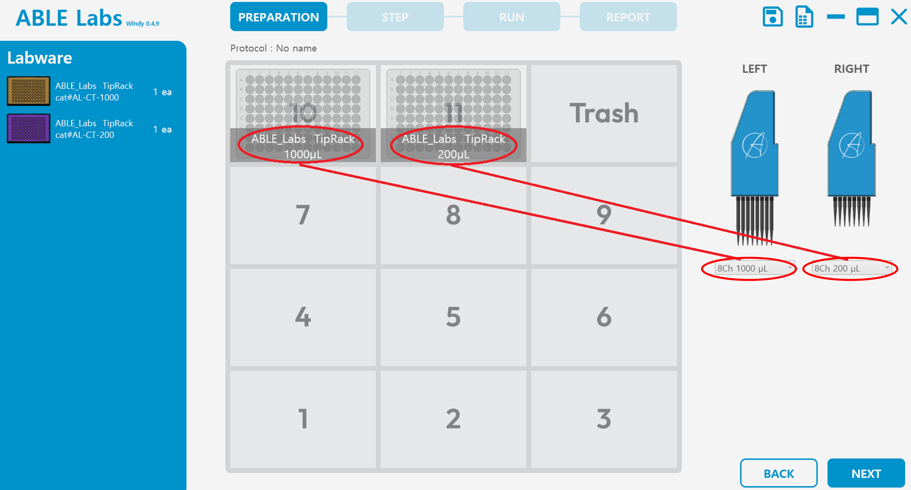
    

    

### 랩웨어 구성

1. 실제 덱 구성과 일치하도록, Windy 화면에서 랩웨어를 구성주세요.

2. 덱 번호를 클릭하면, **`Add Labware`** 라는 문구가 뜨면서 다음 화면으로 이동합니다.

3. 화면 상단의 **`Type`** 에서 종류를 선택하고, **`Model`** 에서 정확한 제품을 골라 주세요.

4. (옵션) **`Nickname`** 을 통해 해당 랩웨어의 이름을 기입하면, 덱 구성 화면이 별명으로 지정됩니다.

    

    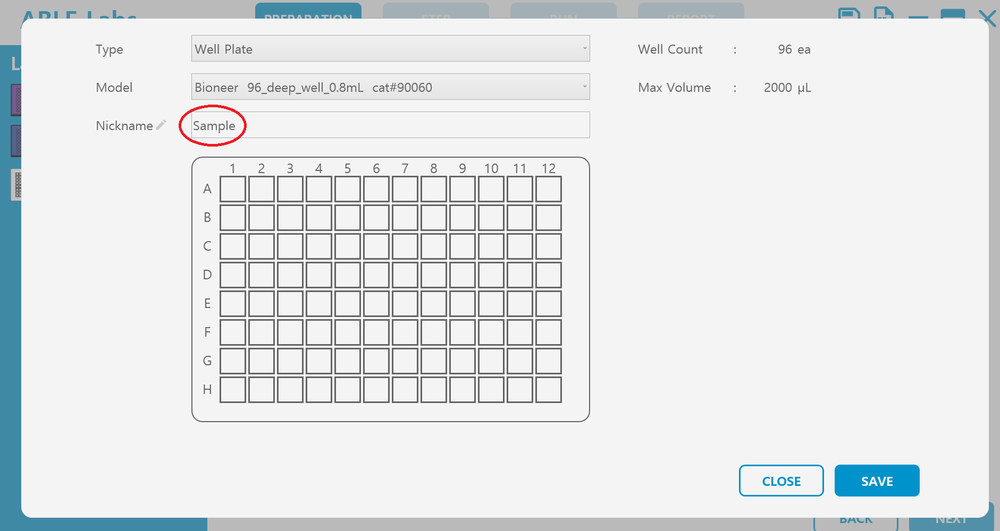
    

5. 우측 하단 **`Save`** 를 클릭하시면, 덱 구성을 위한 **`PREPARATION`** 화면으로 돌아옵니다.
    

    
6. 왼쪽 **`Labware`** 섹션에서 지정한 랩웨어를 볼 수 있습니다. 
    
    

    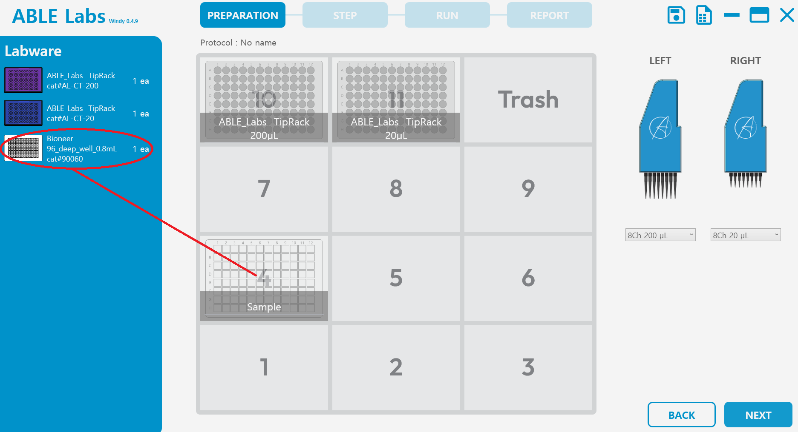
    

    
7. 이 과정을 반복해서 덱 구성을 완성합니다. 

8. 덱 구성이 완료되면, 우측 하단은 **`NEXT`** 버튼을 클릭하여 프로토콜 구성 단계인 **`STEP`** 으로 넘어갑니다.

 

<h4 style="margin-top:0;">💡 랩웨어 관리 기능</h4>

<ol>
  <li><strong>랩웨어 삭제하기</strong> 
      삭제할 랩웨어에 마우스를 올리면 <strong>좌측 상단에 삭제 아이콘</strong>이 표시됩니다.
  </li>
  <li><strong>랩웨어 복사하기</strong> 
      복사할 랩웨어에 마우스를 올리면 <strong>우측 상단에 복사 아이콘</strong>이 표시됩니다. 
      클릭 시 ‘이름(2)’, ‘이름(3)’ 형식으로 자동 복사됩니다.
  </li>
  <li><strong>랩웨어 이름 변경하기</strong> 
      해당 랩웨어 하단의 지정된 이름을 지우고 새 이름을 입력합니다.
  </li>
  <li><strong>랩웨어 위치 변경하기</strong> 
      랩웨어 위치를 잘못 지정한 경우, 마우스로 <strong>드래그하여 원하는 위치로 이동</strong>할 수 있습니다.
  </li>
</ol>

## 3. STEP 구성

Windy의 STEP 단계에서는 프로토콜을 세부 동작을 설정합니다. 이 단계에서 **피펫·소스·타깃·웰 설정 및 샘플 분주 조건**을 지정합니다.

### STEP 진입

1. 좌측 상단의 **`+` 버튼**을 클릭하여 새로운 Step을 추가합니다.

2. 화면이 **[LABWARE] 섹션**으로 이동하며, 덱 구성이 표시됩니다.

### Pipette 선택

1. **`PREPARATION`** 단계에서 지정한 파이펫 중 현재 Step에서 사용할 파이펫을 선택합니다. 
    
    

    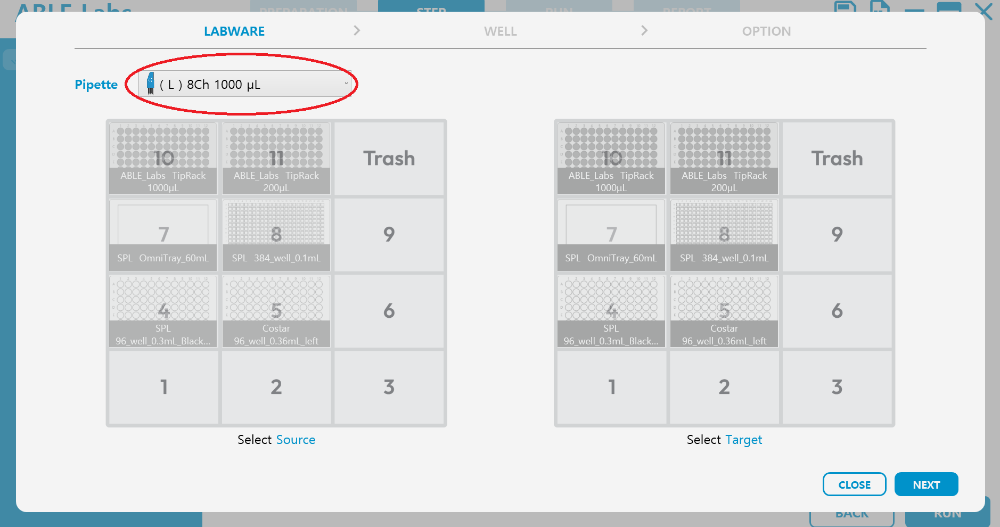
    

    

### Source / Target Labware 지정

1. 왼쪽과 오른쪽 화면에 동일한 덱 구성이 표시됩니다. 
왼쪽 덱에서 **[Source]** , 오른쪽 덱에서 **[Target]** 랩웨어를 클릭하여 지정합니다.

2. 지정이 완료되면 **우측 하단의 `NEXT` 버튼**을 클릭하여 다음 단계로 이동합니다.

### Well 설정

1. 마우스를 드래그하여 선택할 **[Source Well]** 과 **[Target Well]** 을 지정합니다.

    - 전체 웰 선택: **`ALL`** 버튼

    - 선택 해제: **`CLEAR`** 버튼
    

    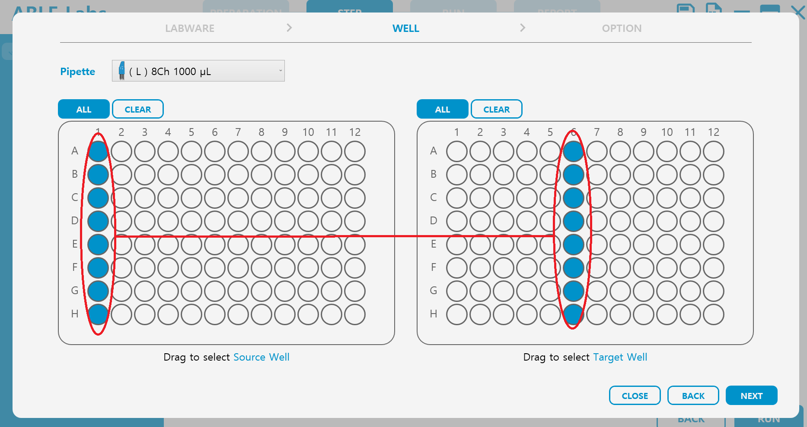
    

💡 필요한 웰을 <strong>마우스로 드래그</strong> 하여 범위 지정할 수 있습니다.

 

2. 선택이 완료되면 **`NEXT` 버튼**을 눌러 다음 단계로 이동합니다.

⚙️ <strong>버튼 설명</strong> 
- <strong>CLOSE</strong>: 설정을 저장하지 않고 첫 화면으로 돌아갑니다. 
- <strong>BACK</strong>: 이전 단계의 [Source] / [Target] 설정 화면으로 돌아갑니다.

</aside>

### Dispense 설정 및 저장

1. [Target] 랩웨어의 각 well에 분주할 샘플의 **Dispense Volume 을 입력**합니다.
2. 입력 후 **`SAVE`** 버튼을 눌러 저장합니다.
3. 위 과정을 반복하면 모든 step 을 완성하고, 확인한 후

### OPTION 세부 설정

#### 1. 기본 옵션 설정
**✔️ Tip 사용 관련 옵션**
- 아무 옵션도 선택하지 않을 경우 step마다 팁을 교체합니다.  
- **[Reuse tips from the previous step]** : 바로 전 step에서 사용한 팁을 그대로 사용합니다.  
- **[Change tips before every aspirate]** : 흡입/분주 시마다 팁을 교체하여 오염을 방지합니다.

**✔️ [Blowout]**    
- 분주 후 tip 내부를 비우는 기능으로, 잔여물을 처리할 위치를 지정합니다.  
  - **[Source]**: 잔여물을 원액과 합침  
  - **[Target]**: 잔여물을 타깃과 합침  
  - **[Trash]**: 잔여물을 폐기물통에 버림  

**✔️ [Pause Pipette]**
- 흡입 및 분주 후 파이펫을 잠시 멈추는 기능으로, 대기 시간·높이·속도를 지정할 수 있습니다.  
- 기본 높이는 흡입/분주 높이와 동일하게 설정되어 있으며, **`+/-`** 버튼으로 상하 조정이 가능합니다.  
- **예시:** 설정된 흡입/분주 위치에서 **7 mm** 상승한 위치로 이동 →  
  Z축 기준 속도의 **80%**로 이동 후 **6초간 대기**

  

**✔️ [Aspirate Speed] / [Dispense Speed]**
- 흡입 혹은 분주의 파이펫팅 속도를 조절합니다.  
  - 현재 설정된 pipette의 기준 속도는 **100%** 입니다.  
  - 5~10% 단위로 조정하여 최적의 속도를 설정하세요.

**✔️ [Mix]**
- 시료를 섞는 기능으로, 용량·횟수·흡입 및 분주 후 대기 시간·속도를 지정할 수 있습니다.  
- **예시:**  
  - ‘2 μL’만큼 ‘3회’ 흡입/분주를 반복  
  - 흡입 후 ‘4초’ 대기, 분주 후 ‘4초’ 대기  
  - 흡입/분주 속도는 현재 설정된 pipette 기준 속도의 ‘50%’

  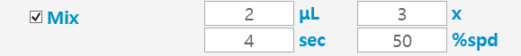

**✔️ [Tip Depth]**
- 랩웨어 바닥에서부터 1.5mm 떨어진 지점이 **‘0 mm’** 로 설정되어 있습니다.  
- 조정 가능한 범위: **-1.5 mm ~ +15 mm**

**✔️ [Pre-Wetting]**
- 프로토콜 실행 전 팁 내부를 적셔 흡입/분주의 정확도를 높이는 기능입니다.  
- 새 팁을 픽업할 때마다 Pre-Wetting이 자동으로 진행됩니다.  
- **예시:**  
  - ‘흡입 → 1.5초 대기 → 분주 → 1.5초 대기’ 5회 반복  
  - 속도는 설정된 **[Aspirate Speed]**와 동일  

  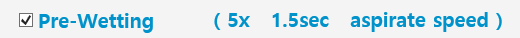

#### 2. Dispense Method / Pipette Route

**[Dispense Method]** : **[Source]** 가 **단수**의 well, **[Target]** 이 **복수**의 well일 때 분주 방식을 지정하는 기능입니다.

1️⃣ <strong>1채널</strong> : [Source]가 1개의 well, [Target]이 다수의 well일 때  

  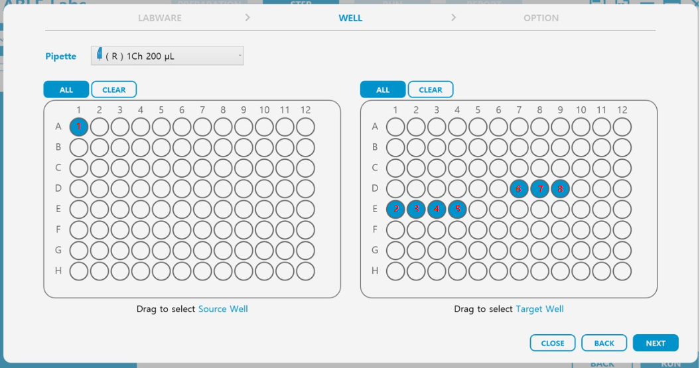

  <strong>✔️ [Single]</strong>: 흡입 → 분주가 반복됩니다. 
  예: 1(흡입) → 2(분주) → 1(흡입) → 3(분주) → …  
  <strong>✔️ [Multi]</strong>: 1회 흡입 후 연속 분주합니다. 
  예: 1(흡입) → 2(분주) → 3(분주) → 4(분주) …

 

8️⃣ <strong>8채널</strong> : [Source]가 1개의 column (세로 한 줄), [Target]이 다수의 column일 때  

  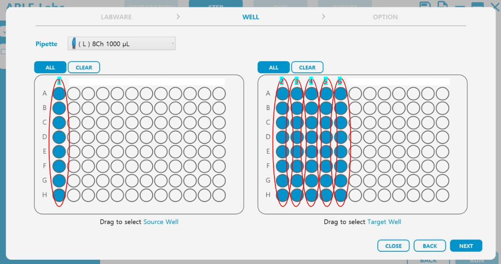

  <strong>✔️ [Single]</strong>: 각 column별로 흡입 → 분주가 반복됩니다. 
  <strong>✔️ [Multi]</strong>: 1회 흡입 후 column별 분주가 반복됩니다.

 

#### 3. Aspirate Method

**[Aspirate Method]** : **[Source]** 가 **복수**의 well, **[Target]** 이 **단수**의 well일 때 흡입 방식을 지정합니다.

1️⃣ <strong>1채널</strong> : [Source]가 다수의 well, [Target]이 1개의 well일 때  

  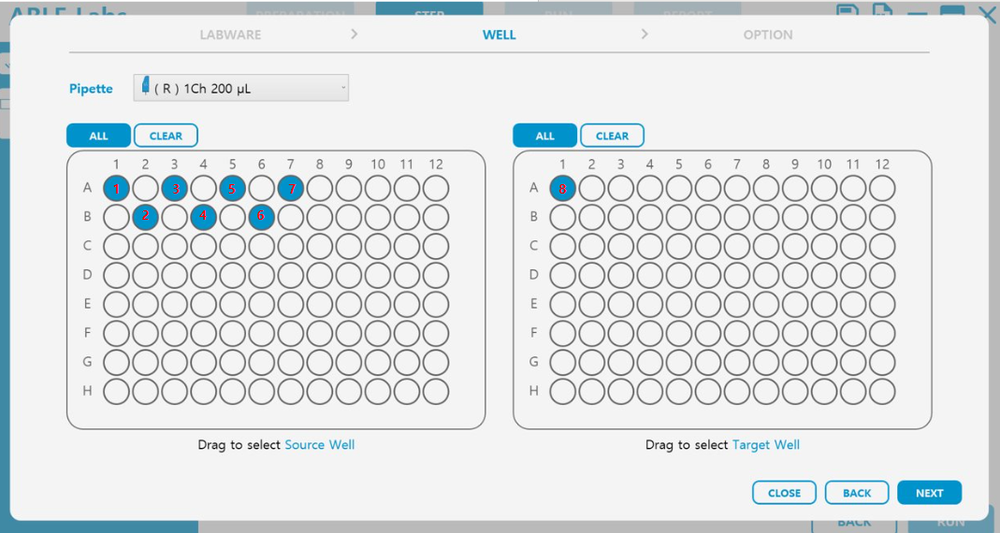

  <strong>✔️ [Single]</strong>: 각 well에서 흡입 후 타깃으로 분주 
  <strong>✔️ [Multi]</strong>: 여러 well을 연속 흡입 후 타깃으로 분주

 

8️⃣ <strong>8채널</strong> : [Source]가 다수의 column, [Target]이 1개의 column일 때  

  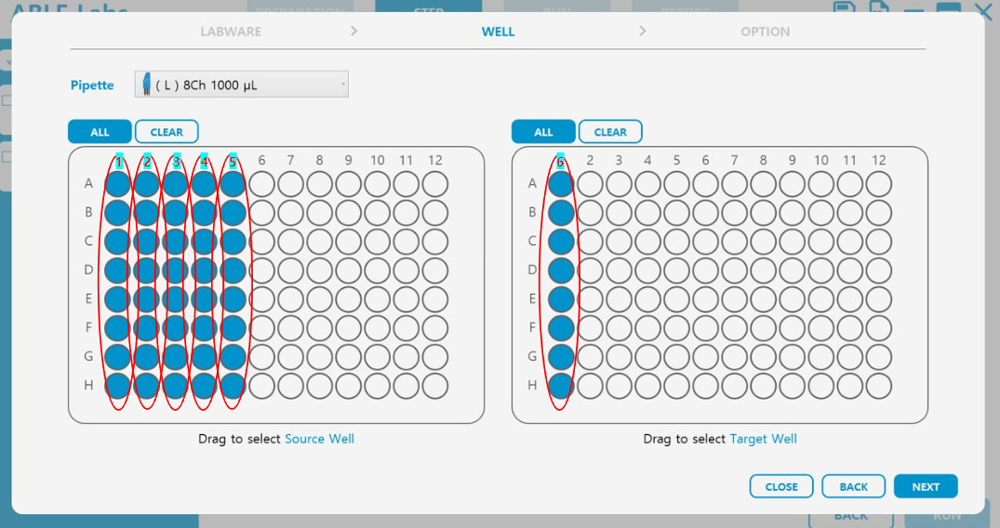

  <strong>✔️ [Single]</strong>: 각 column에서 흡입 후 타깃으로 분주 
  <strong>✔️ [Multi]</strong>: 여러 column을 흡입 후 일괄 분주

#### 4. Pipette Route

**[Pipette Route]** : **[Source]** 또는 **[Target]** 랩웨어가 복수일 때 흡입/분주 경로를 지정하는 기능입니다. 
- **✔️ [Serial]** : 한 랩웨어의 작업을 모두 완료한 뒤 다음 랩웨어로 이동 
- **✔️ [Parallel]** : 각 랩웨어를 column(세로열) 단위로 병렬 처리

<!-- 경우 1 -->

<strong>경우 1️⃣</strong> : <strong>[Source]</strong> 랩웨어 1개, <strong>[Target]</strong> 랩웨어 여러 개  

  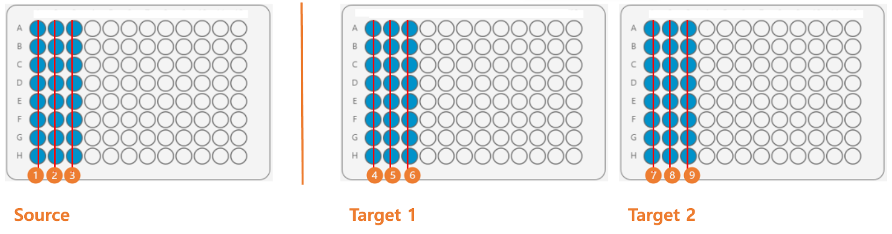

  <strong>✔️ [Serial]</strong> : 랩웨어 중심 
  &nbsp;&nbsp;• <strong>[Single]</strong> : 1(흡입) → 4(분주) → 2(흡입) → 5(분주) → 3(흡입) → 6(분주) → 1(흡입) → 7(분주) → 2(흡입) → 8(분주) → 3(흡입) → 9(분주) 
  &nbsp;&nbsp;• <strong>[Multi]</strong> : 해당 없음  

  <strong>✔️ [Parallel]</strong> : Well 중심
  &nbsp;&nbsp;• <strong>[Single]</strong> : 1(흡입) → 4(분주) → 1(흡입) → 7(분주) → 2(흡입) → 5(분주) → 2(흡입) → 8(분주) → 3(흡입) → 6(분주) → 3(흡입) → 9(분주)
  &nbsp;&nbsp;• <strong>[Multi]</strong> : 1(흡입) → 4(분주) → 7(분주) → 2(흡입) → 5(분주) → 8(분주) → 3(흡입) → 6(분주) → 9(분주)

 
<!-- 경우 2 -->

<strong>경우 2️⃣</strong> : <strong>[Source]</strong> 랩웨어 여러 개, <strong>[Target]</strong> 랩웨어 1개  

  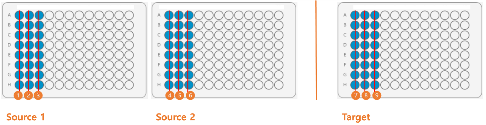

  <strong>✔️ [Serial]</strong> : 랩웨어 중심 
  &nbsp;&nbsp; • <strong>[Single]</strong> : 1(흡입) → 7(분주) → 2(흡입) → 8(분주) → 3(흡입) → 9(분주) → 4(흡입) → 7(분주) → 5(흡입) → 8(분주) → 6(흡입) → 9(분주) 
  &nbsp;&nbsp; • <strong>[Multi]</strong> : 해당 없음  

  <strong>✔️ [Parallel]</strong> : Well 중심
  &nbsp;&nbsp; • <strong>[Single]</strong> : 1(흡입) → 7(분주) → 4(흡입) → 7(분주) → 2(흡입) → 8(분주) → 5(흡입) → 8(분주) → 3(흡입) → 9(분주) → 6(흡입) → 9(분주)
  &nbsp;&nbsp; • <strong>[Multi]</strong> : 1(흡입) → 4(흡입) → 7(분주) → 2(흡입) → 5(흡입) → 8(분주) → 3(흡입) → 6(흡입) → 9(분주)

    
---
    

# 3. 프로토콜 실행 및 결과 확인

## 1. RUN - 프로토콜 실행

1. **[STEP]** 단계에서 프로토콜 구성이 완료되었거나, 기존 프로토콜을 불러왔다면, 이제 **[RUN]** 으로 로봇을 시작할 차례입니다.

2. 모든 스텝 혹은, 일부 스텝만 선택하여 **`RUN`** 할 수 있습니다.
    1. 모든 스텝을 돌릴 경우, 우측 하단 **`RUN`** 을 클릭합니다.
    2. 일부 스텝만 돌릴 경우, 해당 스텝 옆의 네모 박스를 체크한 후, **`RUN`** 을 클릭합니다.
        
    

    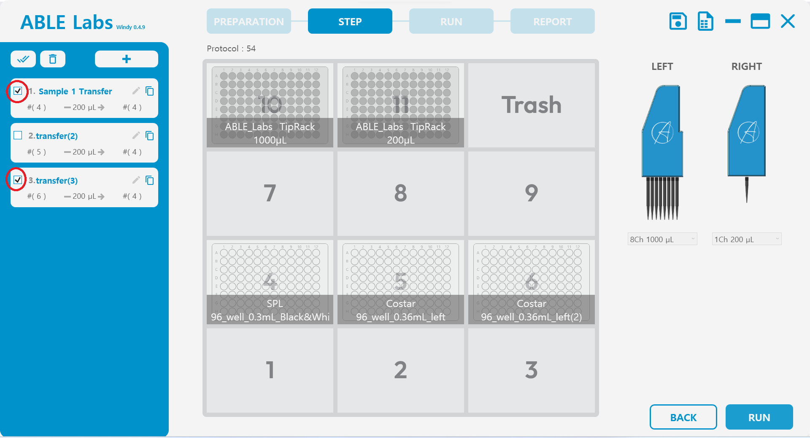
    

3. 새 프로토콜이거나, 기존 프로토콜에서 변화가 있을 경우, 저장 여부를 묻는 창이 뜹니다. 
    
    

    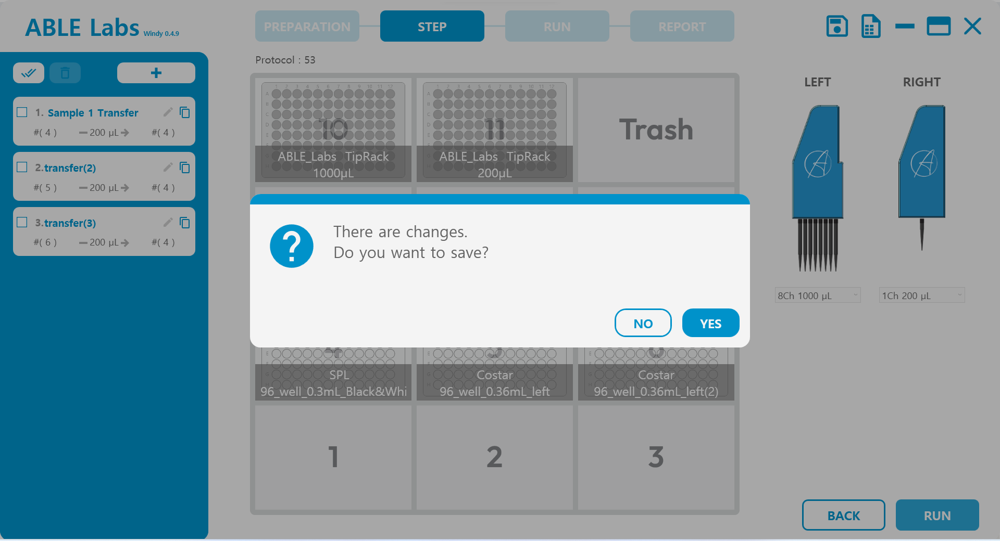
    

    
4. 선택된 스텝의 수를 확인한 후 **`YES`** 를 눌러 주세요.
    - 특정 프로토콜 지정 없이, 모든 스텝을 돌릴 경우, 아래와 같은 메시지가 뜹니다.
        
    

    
    

        
    - 일부 스텝만 돌릴 경우, 괄호 안에 선택된 스텝의 수가 표기됩니다.

## 2. 기존 프로토콜 불러오기

아래 네 가지 방법으로 기존 프로토콜을 불러올 수 있습니다.

1. **`IMPORT` 로 불러오기**
    - 저장된 프로토콜 파일 불러옴. 
    - **`RUN`** 시 지정한 경로의 마지막 폴더가 자동으로 열림.

2. **첫 화면 중앙 목록에서 선택**
    - 중앙 덱 그림 아래의 목록에서 기존 프로토콜을 선택 가능.

3. **우측 히스토리 목록에서 선택**
    - 최근 생성된 순서대로 표시.
    - [Created Date], [Protocol Name] 기준으로 정렬 가능.

4. **`RECENT PROTOCOL` 불러오기**
    - 최근 열었던(실행하지 않아도 됨) 프로토콜을 바로 불러옴.
    

## 3. REPORT - 결과 확인

#### 리포트 결과 항목 정의
- **[Protocol]**: 프로토콜의 이름
- **[Date]**: 해당 날짜
- **[Start Time]**: 사용자가 **`Yes`** 버튼을 눌러 실험이 시작하는 시점
- **[End Time]:** 실험이 끝나고 팁 제거를 완료하는 시점
- **[Elapsed Time]:** 프로토콜 경과 시간, [Start Time ~ End Time]

#### 추가 기능 버튼 정의
- **[INITIALIZE]:** 파이펫이 쓰레기통으로 이동해 액체와 팁을 버린 후, 기본 위치로 이동합니다.
- **[DROP TIP]**: 파이펫이 쓰레기통으로 이동해 팁을 버립니다.
- **[REMOVE LIQUID]**: 파이펫이 쓰레기통으로 이동해 액체를 모두 분주합니다.
- **[PIPETTE UP]**: 파이펫이 Z축 상단 기준점으로 이동합니다.